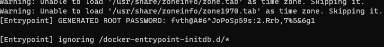

# rss_feeds
Little project of backend for rss feeds handle

# Install Cassandra in docker

Use these commands :

Get last cassandra image : ```docker pull cassandra:latest``` <br>
Create network : ```docker network create cassandra``` <br>
Create docker (and running it) : ```docker run -p 9042:9042 -d --name cassandra --hostname cassandra --network cassandra cassandra``` <br>

# Access cassandra with another docker

Create docker : ```docker run --name=mySqlAccess -d mysql/mysql-server:latest``` <br>
Get logs of docker : ```docker logs mySqlAccess``` <br>
Get root's password generated :  <br>
Get bash of docker : ```docker exec -it mySqlAccess bash``` <br>
Access to mysql commands (insert password when asked) : ```mysql -uroot -p``` <br>
Change password if needed : ```ALTER USER 'root'@'localhost' IDENTIFIED BY '[newpassword]';``` <br>

# Commands to clean docker and network

```docker kill cassandra``` <br>
```docker network rm cassandra```
